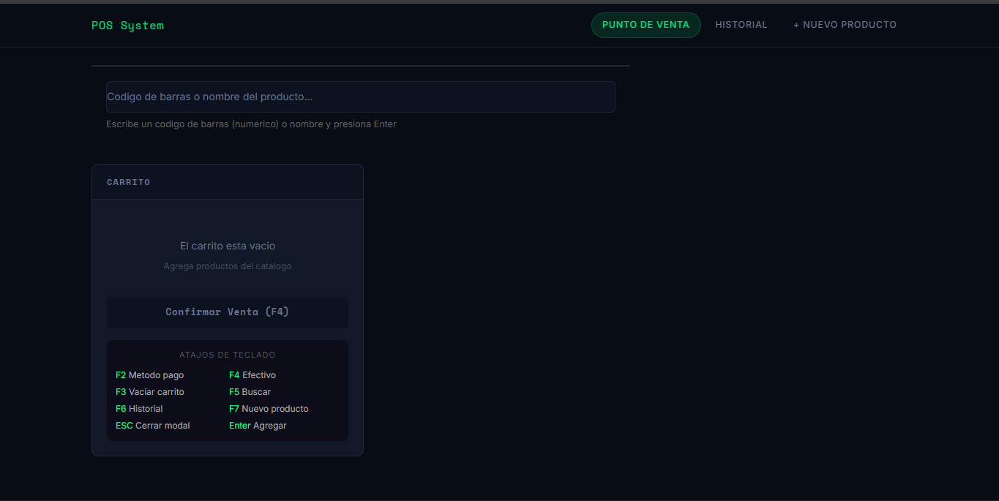
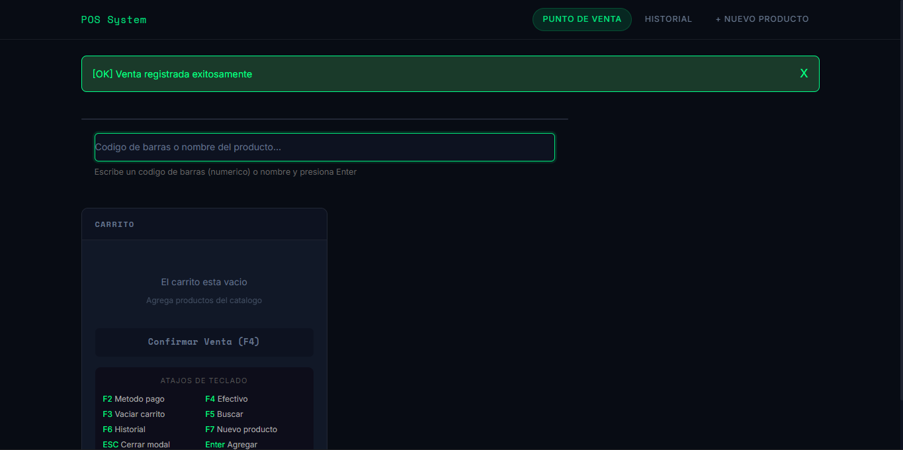
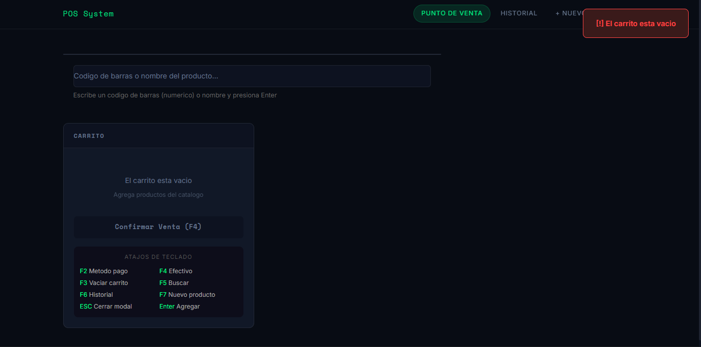

# Sistema POS - Frontend

Sistema de Punto de Venta (POS) construido con Node.js + Express + Handlebars. Consume un API Gateway de AWS para buscar productos y registrar ventas. Disenado para uso en caja registradora con atajos de teclado y tema oscuro.

---

## Arquitectura Cliente-Servidor

El sistema sigue una arquitectura de tres capas:

Navegador (HTML5 + CSS + JS)
  |
  | HTTP - puerto 3000
  v
Frontend (Node.js + Express)
  |
  | HTTP/JSON - fetch + axios
  v
API Gateway (AWS)
  |
  v
AWS Lambda + DynamoDB

---

## Justificacion del Framework

Se eligio Node.js con Express y Handlebars porque:
- Express es minimalista y permite control total sobre rutas y middleware
- Handlebars separa la logica del servidor de las vistas HTML
- Rendering server-side es mas rapido para un POS que no necesita SPA
- JavaScript en frontend y backend reduce la curva de aprendizaje
- Express-session maneja el carrito en servidor, mas seguro que localStorage

---

## Instalacion y Configuracion

### Prerrequisitos
- Node.js 20 o superior
- npm

### 1. Instalar dependencias

`ash
npm install
`\n
### 2. Configurar variables de entorno

Crear archivo .env en la raiz del proyecto:

`\nAPI_BASE_URL=https://zd536se6l8.execute-api.us-east-1.amazonaws.com/Prod
PORT=3000
`\n
### 3. Ejecutar el proyecto

`ash
node app.js
`\n
El servidor quedara corriendo en: http://localhost:3000

---

## Capturas del Sistema

### Vista principal POS

### Venta exitosa

### Manejo de error

---

## Rutas Disponibles

| Ruta | Metodo | Descripcion |
|---|---|---|
| / | GET | Vista principal POS |
| /buscar | GET | Buscar productos por nombre o codigo |
| /historial | GET | Historial de ventas |
| /productos/crear | GET/POST | Crear nuevo producto |
| /carrito/agregar-ajax | POST | Agregar producto al carrito |
| /carrito/items/:id/actualizar | POST | Actualizar cantidad |
| /carrito/items/:id/eliminar | POST | Eliminar del carrito |
| /carrito/vaciar | POST | Vaciar carrito |
| /ventas | POST | Confirmar venta |

---

## Atajos de Teclado

| Atajo | Funcion |
|---|---|
| Enter | Buscar y agregar producto |
| F2 | Modal metodo de pago |
| F3 | Vaciar carrito |
| F4 | Cobro en efectivo con cambio |
| F5 | Enfocar input de busqueda |
| F6 | Ir a historial |
| F7 | Ir a crear producto |
| ESC | Cerrar modal o volver al inicio |

---

## Proceso SDD (Spec Driven Development)

Este proyecto sigue la metodologia SDD: primero specs, luego implementacion.

Los specs estan en .kiro/specs/pos-frontend/:

| Archivo | Contenido |
|---|---|
| requirements.md | Requisitos funcionales, no funcionales y criterios de aceptacion |
| design.md | Arquitectura, justificacion del framework, contratos con el API |
| tasks.md | Tareas de implementacion en orden de ejecucion |

Flujo SDD seguido:
1. Se escribieron los specs en .kiro/specs/pos-frontend/
2. Kiro leyo los specs y genero las tareas
3. Se implementaron las vistas y rutas trazables a cada tarea
4. Se verifico el funcionamiento end-to-end con el API Gateway

---

## Tecnologias

- Node.js + Express - Servidor web
- Handlebars (HBS) - Motor de plantillas
- Express-session - Manejo de sesion (carrito)
- Axios - Cliente HTTP para consumir API Gateway
- Bootstrap 5 - Grid y componentes base
- CSS propio - Tema oscuro personalizado
- JavaScript vanilla - Fetch, async/await, eventos de teclado
