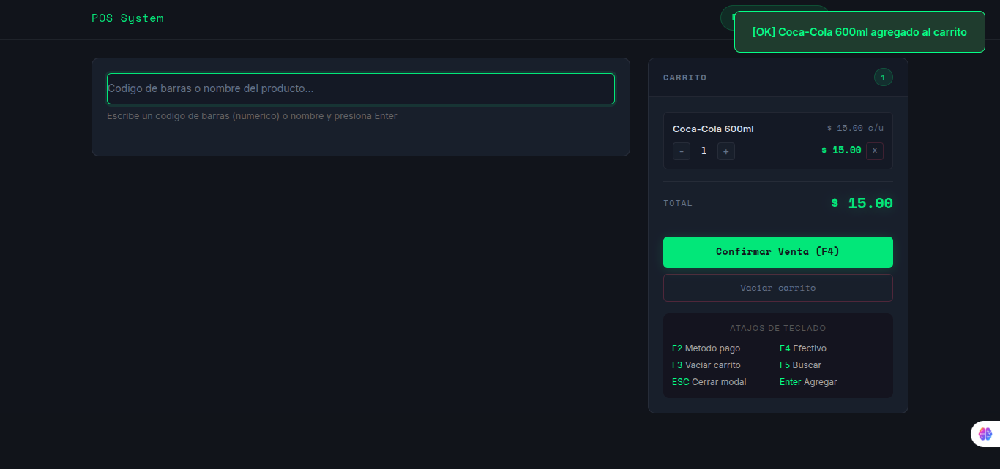
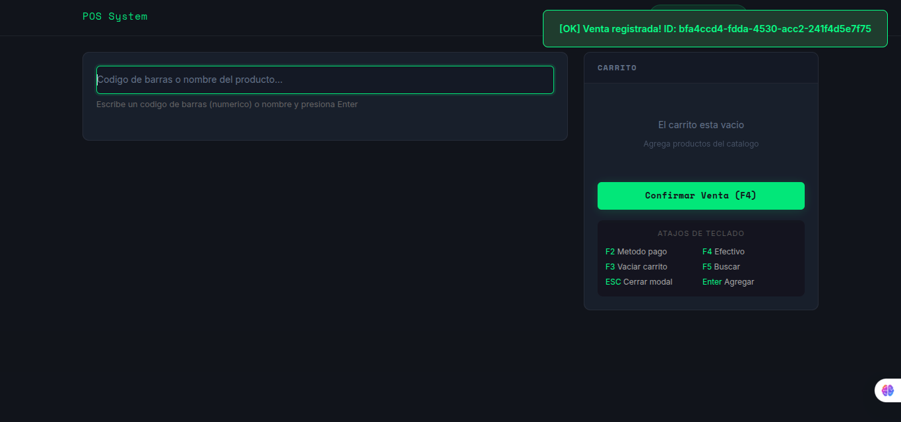
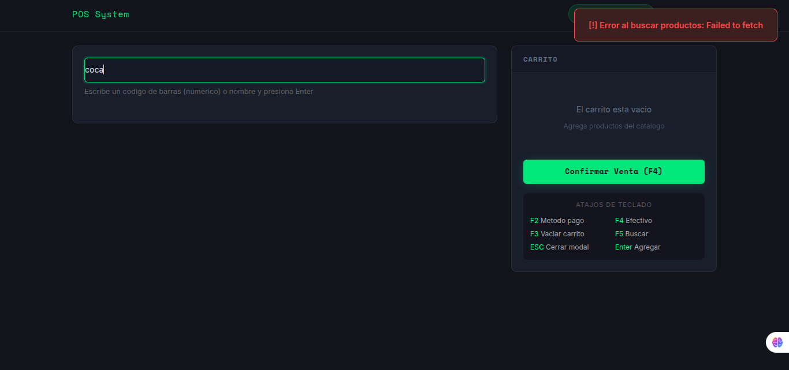

# Sistema POS — Frontend Vanilla JS

Frontend web del sistema POS implementado con Vanilla JS (HTML5 + CSS3 + JavaScript ES6+). Sin frameworks, sin dependencias, sin servidor. Consume el API Gateway de AWS directamente desde el navegador usando `fetch` nativo con `async/await`.

---

## Arquitectura Cliente-Servidor

```
Navegador (index.html + CSS + JS vanilla)
        |
        | fetch() nativo — async/await
        v
API Gateway (AWS)
https://rfs00jdfqb.execute-api.us-east-1.amazonaws.com/Prod
        |
        v
AWS Lambda (Node.js 20.x)
        |
        v
DynamoDB (pos-productos, pos-ventas)
```

### Justificación de Vanilla JS

Se eligió Vanilla JS porque:
- **Control total del DOM**: sin abstracciones — cada elemento se manipula directamente con las APIs nativas del navegador
- **Sin build step**: no requiere webpack, vite ni compilación — el profesor abre `index.html` y funciona inmediatamente
- **fetch nativo**: el navegador tiene `fetch` incorporado — no se necesita ninguna librería externa
- **Demuestra fundamentos**: el parcial evalúa HTML5, CSS y JS — Vanilla JS expone exactamente esos fundamentos sin capas de abstracción
- **Peso cero**: sin `node_modules`, sin bundler — el proyecto pesa kilobytes

---

## Cómo ejecutar el proyecto

### Opción 1 — Abrir directamente (más simple)

```bash
# Clonar el repositorio
git clone https://github.com/Criss26-Robles/proyecto_pos.git
cd proyecto_pos/pos_frontend_vanilla

# Abrir en el navegador
open index.html   # macOS
xdg-open index.html  # Linux
```

O simplemente arrastra el archivo `index.html` al navegador.

### Opción 2 — Con servidor local (recomendado para evitar CORS en algunos navegadores)

```bash
# Con Python
python3 -m http.server 5500

# Con Node.js (npx)
npx serve .
```

Luego abre `http://localhost:5500`

---

## Configurar la URL del API Gateway

La URL base está en un solo lugar: `src/config.js`

```javascript
export const API_BASE_URL = 'https://rfs00jdfqb.execute-api.us-east-1.amazonaws.com/Prod';
```

Para cambiarla, edita solo ese archivo — los servicios la importan automáticamente.

---

## Estructura del proyecto

```
pos_frontend_vanilla/
  index.html                    ← HTML5 semántico (header, main, section, nav, table, form, footer)
  css/
    estilos.css                 ← Tema oscuro, variables CSS, CSS Grid, Flexbox
  src/
    config.js                   ← URL base del API Gateway
    services/
      productosService.js       ← fetch GET /productos con async/await
      ventasService.js          ← fetch POST /ventas con async/await
    app.js                      ← Estado del carrito, renderizado DOM, eventos
  .kiro/
    specs/pos-frontend/
      requirements.md           ← Requisitos funcionales y criterios de aceptación
      design.md                 ← Arquitectura, justificación, contratos del API
      tasks.md                  ← Tareas de implementación en orden
  README.md
  .gitignore
```

---

## Capturas del sistema

### Listado de productos cargado desde el API



### Registro de venta exitosa



### Manejo de error



---

## Proceso SDD (Spec-Driven Development)

Los specs están en `.kiro/specs/pos-frontend/`:

| Archivo | Contenido |
|---------|-----------|
| `requirements.md` | Requisitos funcionales, no funcionales y criterios de aceptación |
| `design.md` | Arquitectura, justificación de Vanilla JS, contratos del API, modelos de datos |
| `tasks.md` | 13 tareas de implementación en orden de ejecución con trazabilidad |

**Flujo SDD seguido:**
1. Se escribieron los specs antes de cualquier línea de código
2. El `design.md` definió la estructura de archivos, los módulos y los contratos del API
3. El `tasks.md` guió la implementación tarea por tarea
4. Cada función en `app.js` es trazable a un requisito del `requirements.md`

---

## Fundamentos evaluados

| Fundamento | Implementación |
|------------|---------------|
| HTML5 semántico | `header`, `nav`, `main`, `section`, `table`, `form`, `footer`, `aria-*` |
| CSS Box Model | `padding`, `margin`, `border` explícitos en todos los componentes |
| CSS Flexbox | Carrito total, header, items del carrito |
| CSS Grid | Layout principal de dos columnas (productos \| carrito) |
| JavaScript eventos | `addEventListener` en botones agregar, eliminar y confirmar |
| async/await | `cargarProductos()`, `confirmarVenta()` con try/catch |
| fetch | `productosService.listar()`, `ventasService.crear()` |
| Manejo de errores | try/catch en todos los fetch, mensajes visibles al usuario |

---

## Tecnologías

- **HTML5** — Estructura semántica
- **CSS3** — Variables CSS, Grid, Flexbox, tema oscuro
- **JavaScript ES6+** — Módulos, async/await, fetch, arrow functions
- **API Gateway AWS** — Backend serverless
