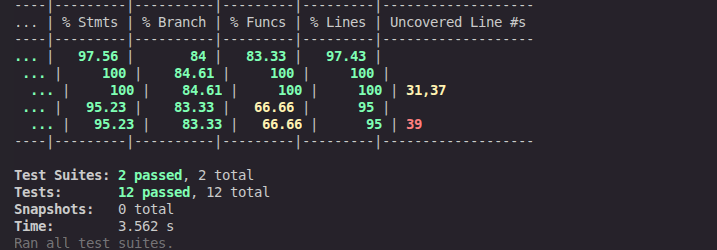
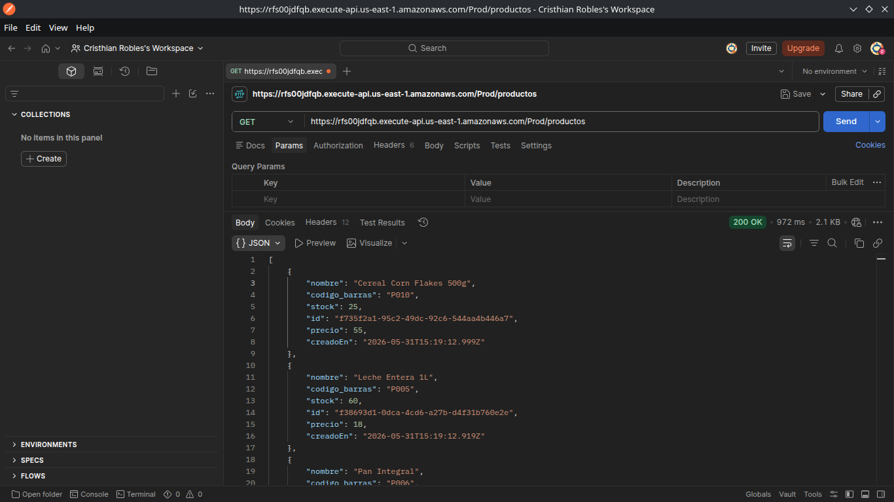
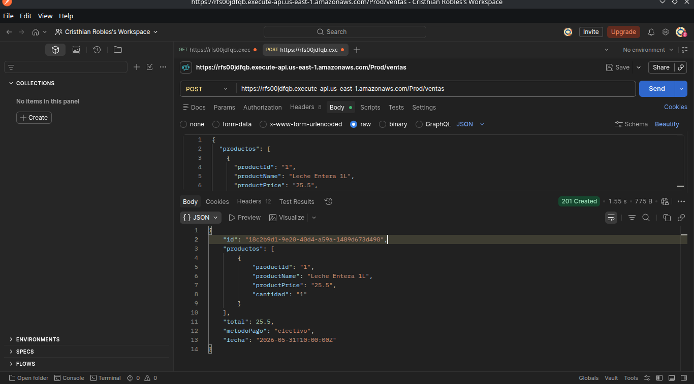
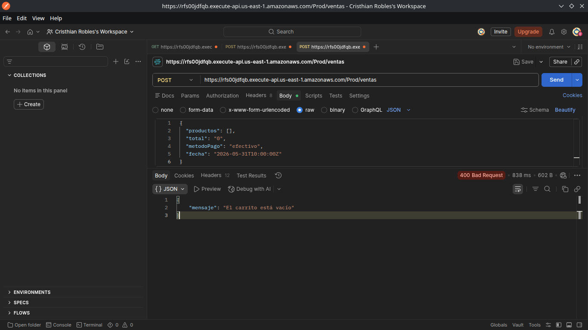

# Sistema POS — Backend Serverless

Backend del sistema POS implementado con AWS SAM (Serverless Application Model). Expone una API REST mediante API Gateway, procesa las peticiones con funciones Lambda en Node.js 20 y persiste los datos en DynamoDB.

---

## Arquitectura del Sistema

```
Cliente (Frontend / Postman)
        |
        | HTTPS
        v
API Gateway (REST API — pos-api)
        |
        | Invocación
        v
AWS Lambda (Node.js 20.x)
        |
        | SDK v3
        v
DynamoDB (pos-productos / pos-ventas)
```

### Componentes desplegados

| Componente | Nombre en AWS | Descripción |
|------------|--------------|-------------|
| API Gateway | `pos-api` | Expone los endpoints REST |
| Lambda | `pos-listar-productos` | GET /productos |
| Lambda | `pos-crear-producto` | POST /productos |
| Lambda | `pos-obtener-producto` | GET /productos/{id} |
| Lambda | `pos-listar-ventas` | GET /ventas |
| Lambda | `pos-crear-venta` | POST /ventas |
| Lambda | `pos-obtener-venta` | GET /ventas/{id} |
| Lambda | `pos-inicializar-datos` | POST /admin/inicializar |
| DynamoDB | `pos-productos` | Catálogo de productos |
| DynamoDB | `pos-ventas` | Historial de ventas |

---

## URL Base del API Gateway

```
https://rfs00jdfqb.execute-api.us-east-1.amazonaws.com/Prod
```

### Endpoints disponibles

| Método | Ruta | Descripción |
|--------|------|-------------|
| GET | `/productos` | Lista todos los productos o filtra por `?q=nombre` |
| GET | `/productos/{id}` | Obtiene un producto por ID |
| POST | `/productos` | Crea un nuevo producto |
| GET | `/ventas` | Lista el historial de ventas |
| GET | `/ventas/{id}` | Obtiene una venta por ID |
| POST | `/ventas` | Registra una nueva venta |
| POST | `/admin/inicializar` | Carga el catálogo inicial de productos |

---

## Instrucciones de Despliegue

### Prerrequisitos

- AWS CLI configurado (`aws configure`)
- AWS SAM CLI instalado (`sam --version`)
- Node.js 20 o superior

### 1. Clonar el repositorio

```bash
git clone https://github.com/Criss26-Robles/proyecto_pos.git
cd proyecto_pos/sales-api-serverless
```

### 2. Instalar dependencias de la capa

```bash
cd layers/dependencias
npm install
cd ../..
```

### 3. Construir

```bash
sam build
```

### 4. Desplegar

```bash
sam deploy --guided
```

Responder a las preguntas:
- Stack Name: `pos-sistema`
- Region: `us-east-1`
- Confirm changeset: `y`
- Allow IAM role creation: `y`
- Save arguments: `y`

### 5. Cargar datos iniciales

```bash
curl -X POST https://rfs00jdfqb.execute-api.us-east-1.amazonaws.com/Prod/admin/inicializar
```

---

## Pruebas Unitarias

Las pruebas usan Jest con mocks de DynamoDB — no requieren conexión a AWS.

```bash
npm install
npm test
```

### Resultados



```
Test Suites: 2 passed, 2 total
Tests:       12 passed, 12 total
Cobertura:   97%
```

### Casos cubiertos

**GET /productos (listar.test.js)**
- ✅ Respuesta exitosa — retorna lista de productos
- ✅ Tabla vacía — retorna lista vacía
- ✅ Filtro por `?q=` — retorna solo coincidencias
- ✅ Filtro por `?nombre=` — compatibilidad con backend
- ✅ Error de conexión a DynamoDB — retorna 500
- ✅ Headers CORS presentes en la respuesta

**POST /ventas (crear.test.js)**
- ✅ Respuesta exitosa — registra venta con 201
- ✅ Carrito vacío — retorna 400
- ✅ Body sin productos — retorna 400
- ✅ Método de pago por defecto es efectivo
- ✅ Error de conexión a DynamoDB — retorna 500
- ✅ Headers CORS presentes en la respuesta

---

## Capturas de Postman

### GET /productos — Respuesta exitosa



### POST /ventas — Venta registrada exitosamente



### POST /ventas — Error: carrito vacío



---

## Proceso SDD (Spec-Driven Development)

Los specs están en `.kiro/specs/pos-backend/`:

| Archivo | Contenido |
|---------|-----------|
| `requirements.md` | Requisitos funcionales, no funcionales y criterios de aceptación |
| `design.md` | Arquitectura, estructura DynamoDB, contratos de endpoints |
| `tasks.md` | Tareas de implementación en orden de ejecución |

**Flujo SDD seguido:**
1. Se escribieron los specs en `.kiro/specs/pos-backend/` antes de cualquier código
2. El `design.md` definió la estructura del `template.yaml` y los contratos de cada Lambda
3. El `tasks.md` guió la implementación función por función
4. Las pruebas unitarias se derivaron de los criterios de aceptación del `requirements.md`
5. Se desplegó con `sam deploy` y se verificó con Postman

---

## Modelo de Datos NoSQL (DynamoDB)

### Tabla pos-productos

```json
{
  "id": "uuid",
  "nombre": "Coca-Cola 600ml",
  "codigo_barras": "P001",
  "precio": 15,
  "stock": 100,
  "creadoEn": "2026-05-31T15:19:12.999Z"
}
```

### Tabla pos-ventas

```json
{
  "id": "uuid",
  "productos": [
    {
      "productoId": "uuid",
      "nombre": "Coca-Cola 600ml",
      "cantidad": 2,
      "precioUnitario": 15
    }
  ],
  "total": 30,
  "metodoPago": "efectivo",
  "fecha": "2026-05-31T15:33:10.866Z"
}
```

Los productos de la venta están **embebidos** en el documento — sin JOINs, sin tablas relacionales. Esto es el modelo NoSQL de DynamoDB.

---

## Tecnologías

- **AWS SAM** — Infraestructura como código
- **AWS Lambda** — Funciones serverless Node.js 20.x
- **AWS API Gateway** — REST API con CORS habilitado
- **AWS DynamoDB** — Base de datos NoSQL, modo PAY_PER_REQUEST
- **AWS SDK v3** — `@aws-sdk/client-dynamodb` + `@aws-sdk/lib-dynamodb`
- **Jest** — Pruebas unitarias con mocks
